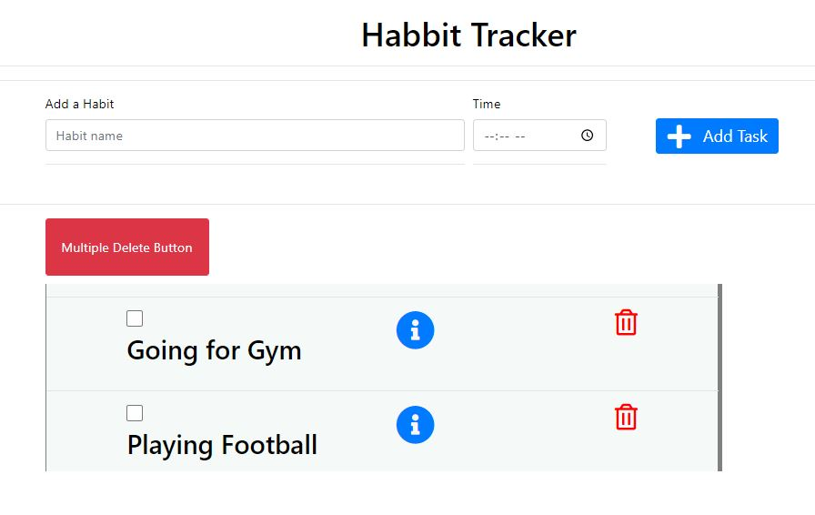
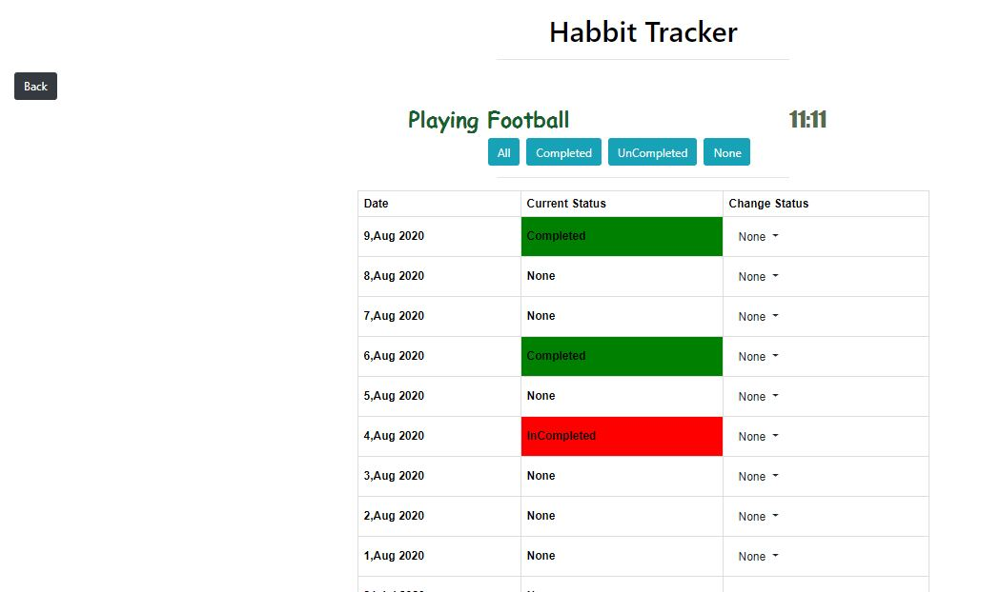

# HabitTrackerNodeJs

Simple habit tracker made using ExpressJS framework,MongoDBand  NodeJs. 
This application provides very basic functionalities like adding a habit, 
deleting a single and multiple habits and update the status of each habit for last 15 days.
Also Filter the habits based on the Status.

# Libraries Required:
     "ejs": "^3.1.3",
    "express": "^4.17.1",
    "express-ejs-layouts": "^2.5.0",
    "mongoose": "^5.9.18",
    "nodemon": "^2.0.4",
    "express-ejs-layouts": "^2.5.0"
    "connect-mongo": "^3.2.0",
This data is directly acquired from package.json.

# Project Structure:
          
* assets: contains all static files like css, js. 
* config: Contains configuration js for mongoose . 
* models: Contains db collection . 
* controllers: Contains all the controller functions. 
* Routes: Contains all routes. 
* views: Contains all views. 

# Starting the Project:

* Download as zip and extract in your local system.
* Open folder in VS code
* Open terminal and make the project folder as your current directory
* Install all the libraries mentioned above.
* To start the server, use command: npm start
* Go to https://localhost/8000 on your browser to use the application.

# Home Page 

# Activity Details
* 

